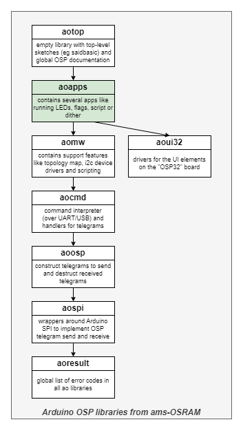
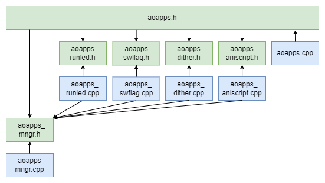

# OSP ReusableApps aoapps

Library "OSP ReusableApps aoapps", usually abbreviated to "aoapps", 
is one of the **aolibs**; short for Arduino OSP libraries from ams-OSRAM.
This suite implements support for chips that use the Open System Protocol, 
like the AS1163 ("SAID") or the OSIRE E3731i ("RGBi").
The landing page for the _aolibs_ is on 
[GitHub](https://github.com/ams-OSRAM/OSP_aotop).


## Introduction

Library _aoapps_ is a library with reusable "apps" for OSP chains.
Multiple apps form one firmware image (or executable) for the ESP32 
as  explained below.





This library contains several apps. In this context, and app is a module 
that exposes a `step()` function, which is constantly called from the 
main loop, and which manages the animation implemented by the app.

In addition to the apps, this library also contains an _app manager_. 
A top-level sketch includes the manager and registers one or more apps, 
either from this library or from elsewhere (self developed). Typically 
the "A" button on the OSP32 board is used to tell the app manager
to switch from one app to the next.

See below a high level sketch of the app (manager) architecture.

```cpp
void apps_register() {
  aoapps_aniscript_register();
  aoapps_runled_register();
  aoapps_swflag_register();
  aoapps_dither_register();
}


void setup() {
  ...

  // Init the Library
  aoapps_init();
  
  // Register all apps
  apps_register();

  // Start the first app
  aoapps_mngr_start();
}


void loop() {
  // Check physical buttons
  aoui32_but_scan();

  // Switch to next app when A was pressed
  if( aoui32_but_wentdown(AOUI32_BUT_A) ) aoapps_mngr_switchnext();

  // Let current app progress
  aoapps_mngr_step();
}
```


## Examples

This library comes with the following examples.
You can find them in the Arduino IDE via 
File > Examples > OSP ReusableApps aoapps > ...

- **aoapps_switch** ([source](examples/aoapps_switch))  
  This demo implements an application with two (dummy) apps.
  By pressing but A, the user can switch between the apps.
  The name of the active app is shown on the OLED.
  The green and red signaling LED show heart beat and error.
  App1 shows how to process button presses.
  App2 goes into error after a while (to show that the green heart beat 
  LED stops and the red error LED switches on).

- **aoapps_runled** ([source](examples/aoapps_runled)) 
  This demo shows how to run an app.
  It uses the "runled" app, which has been made to expose its internals;
  the start, step and stop function.


## Module architecture

This library contains several modules, see figure below (arrows indicate `#include`).



- **aomw_mngr** (`aomw_mngr.cpp` and `aomw_mngr.h`) is the only non-app module.
  It is the app manager. It implements a register of apps in the
  sketch. It implements functions to start, step and stop an app. These
  are called from the main loop, and forwarded to the running app.
  In practice, the `step()` function is constantly called from the main loop 
  and manages the animation implemented by the app.
  
  This module also implements a command (to be registered with `aocmd_cint` 
  if so desired). This handler allows the user to see which apps are 
  available, which is running, and it allows to switch the running app.
  
- **aoapps_runled** (`aoapps_runled.cpp` and `aoapps_runled.h`) is one of the stock apps.
  - There is a "virtual cursor" that runs from the begin of the chain to the end and then back.
  - Chain length and node types are auto detected.
  - Every 25ms the cursor advances one LED and paints that in the current color.
  - Every time the cursor hits the begin or end of the chain, it steps color.
  - Color palette: red, yellow, green, cyan, magenta.
  - The X and Y buttons control the dim level (RGB brightness).
  - The goal is to show that various OSP nodes can be mixed and have color/brightness matched.

- **aoapps_swflag** (`aoapps_swflag.cpp` and `aoapps_swflag.h`) is one of the stock apps.
  - Shows one (static) flag at a time, eg the Dutch national flag red/white/blue spread over the OSP chain.
  - Tries to find a SAID with an I2C bridge with an I/O-expander (with four buttons and four indicator LEDs).
  - If there is no I/O-expander, shows four static flags switching on a time basis.
  - If there are multiple I/O-expanders the first one is taken.
  - When an I/O-expander is found the four buttons select which flag to show.
  - The indicator LEDs connected to the I/O-expander indicate which button/flag was selected.
  - The X and Y buttons control the dim level (RGB brightness).
  - This app adds a command to configure which four flags will be shown.
  - The goal is to show a "sensor" (button) being accessible from the root MCU (the ESP).

- **aoapps_dither** (`aoapps_dither.cpp` and `aoapps_dither.h`) is one of the stock apps.
  - The LEDs are in a dimming cycle (dim up, then dim down, then up again, etc).
  - All LEDs dim synchronously and at the same level (so RGBs look white).
  - Dithering (SAID LED driver feature) can be enabled/disabled.
  - The X button toggles dim cycling on/off.
  - The Y button toggles dithering on/off.
  - The goal is to show the effect of dithering.

- **aoapps_aniscript** (`aoapps_aniscript.cpp` and `aoapps_aniscript.h`) is one of the stock apps.
  - Plays a light show as defined by an animation script.
  - Tries to find a SAID with an I2C bridge with an EEPROM.
  - If there is an external EEPROM stick (I2C address 0x51) it favors that over an internal EEPROM (address 0x50).
  - If there are multiple (of the same kind, external or internal) the first one is taken.
  - If no EEPROM is found, uses the heartbeat script included in the firmware.
  - If an EEPROM is found, loads the script from the EEPROM and plays that.
  - The internal EEPROM (on the SAIDbasic board) contains the rainbow script.
  - External EEPROMs are flashed with bouncing-block and color-mix.
  - The X and Y buttons control the FPS level (frames-per-second animation speed).
  - The goal is to show that the root MCU can access I2C devices (EEPROM) e.g. for calibration values.
  - Note, the tool [eepromflasher](https://github.com/ams-OSRAM/OSP_aotop/tree/main/examples/eepromflasher)
    allows flashing EEPROMs with the various animation scripts.


## API

The header [aoapps.h](src/aoapps.h) contains the API of this library.
It includes the module headers [aoapps_mngr.h](src/aoapps_mngr.h), 
[aoapps_runled.h](src/aoapps_runled.h), [aoapps_swflag.h](src/aoapps_swflag.h), 
[aoapps_dither.h](src/aoapps_dither.h), and
[aoapps_aniscript.h](src/aoapps_aniscript.h).
The headers contain little documentation; for that see the module source files. 

### aoapps

- `aoapps_init()` to initialize the library (the apps manager).
- `AOAPPS_VERSION`  identifies the version of the library.


### aoapps_mngr

There is an init function, but that is called from the library's init.
- `void aoapps_mngr_init()`.

An important aspect of the app manager is app registration. 
- `aoapps_mngr_register(...)` registers an app (its name, some OLED labels, 
  its start, step an stop functions, an optional command handler, and some flags).
- `aoapps_mngr_start_t`, `aoapps_mngr_step_t`, `aoapps_mngr_stop_t` types for
  to start, step and stop function.
- `AOAPPS_MNGR_FLAGS_HIDDEN`, `AOAPPS_MNGR_FLAGS_WITHTOPO`, 
  `AOAPPS_MNGR_FLAGS_WITHREPAIR` and `AOAPPS_MNGR_FLAGS_NEXTONERR` 
  registration flags.
- `AOAPPS_MNGR_REGISTRATION_SLOTS` maximum number of apps that can 
  be registered.

The top level sketch needs to start an app, but also continuously step it.

- `aoapps_mngr_start(appix)` start an app; e.g. called from `setup()`.
- `aoapps_mngr_step()` step an app continuously for its animation; e.g. called from `loop()`.
- `aoapps_mngr_stop()` stop an app (to switch off hardware), before starting another app.
- `aoapps_mngr_switch(appix)` shorthand for stopping current app and starting app `appix`.
- `aoapps_mngr_switchnext()` shorthand for stopping current app and starting next app (in registration order).

There are some observers of the state of the running app, 
typically these are not needed by the application.

- `aoapps_mngr_app_appix()` index of current app.
- `aoapps_mngr_app_running()` indicates if current app is running.

There are some observers for the registry, 
typically these are not needed by the application.

- `aoapps_mngr_app_count()` count of registered apps.
- `aoapps_mngr_app_name(appix)` (short) name (identifier) of an app
- `aoapps_mngr_app_oled(appix)` (long) name (human readable on OLED) of an app.

This module also implements a command (to be registered with `aocmd_cint` if
so desired). This handler allows the user manage apps.

- `aoapps_mngr_cmd_register()` registers the app manager with the command interpreter.
  See "Configuration commands" below for details.


### aoapps_runled 

- `aoapps_runled_register()` registers the runled app with the app manager.

- `aoapps_runled_start()`, `aoapps_runled_step()`, `aoapps_runled_stop()`
   are external, making it easier to demo this app without the manager.


### aoapps_swflag

- `aoapps_swflag_register()` registers the swflag app with the app manager.
- `aoresult_t aoapps_swflag_resethw()` resets the I/O-expander, thereby 
  switching off the indicator LEDs attached to it. This helps reset the PCB
  state when the MCU is reset.


### aoapps_dither

- `aoapps_dither_register()` registers the dither app with the app manager.


### aoapps_aniscript

- `aoapps_aniscript_register()` registers the aniscript app with the app manager.


## Execution architecture

To keep execution architecture simple, top-level sketches employ a 
"main loop", e.g. the `loop()` function in Arduino. The down side of a 
main loop architecture is that individual actions (function calls) 
executed by the main loop must be short. That way they can be interleaved
and deadlines are not exceeded.

For this reason, apps have a start/step/stop interface.
The start is called once, and sets up the internal state machine of the app.
Next the step is continuously called, and the app uses these triggers
to advance its state machine, in effect running some kind of animation
or sensor polling. The stop is usually empty, but some apps need to do some
cleanup (reset app specific hardware).

Most apps are build on top of the `aomw_topo` module since this abstracts
away the differences between various node types; apps then simply query 
how many RGB triplets there are an animate over all of them. To make using 
topo simple, app registration can pass the flag `AOAPPS_MNGR_FLAGS_WITHTOPO`.
With this flag the app manager will first build the topo map 
(in many "steps") before calling the app's start.

The OSP32 board has a rather poor power supply (1A USB). In larger demo's, 
especially with higher levels of RGB brightness, nodes tend to be hit by 
"under voltage faults", making their LEDs switch off. When an app registers 
with the flag `AOAPPS_MNGR_FLAGS_WITHREPAIR`, the app manager will 
periodically broadcast a "clear error" and "go active" telegram to mitigate
this problem. By the way, it is also possible to power the OSP32 board
via a pin header instead of via USB, bypassing the 1A USB limit.

If an app runs into errors, its `step()` will return an error code. The
app manager normally flashes the green heart beat LED, but will then stop
doing that and instead switch on the red error LED. It will also show the
error on the OLED. In effect that "app crashed" and nothing will happen 
anymore. The user is still able to press A to switch to the next app. More
presses on A will eventually re-start the offending app (which might crash 
again). When an app registers with the flag `AOAPPS_MNGR_FLAGS_NEXTONERR`, 
the app manager will, when that app returns an error, do as before (stop
heart beat, switch on red LED, show error on OLED), but after a time-out start
the next app.

The list of registered apps can become long. For a specific demo, apps
can be hidden, so that the demonstration can focus on specific apps. 
When an app is hidden, it is skipped in the `switchnext()` cycle, which is 
typically executed when pressing the A button. The voidapp registers itself 
as hidden, for other apps hide them via the command `apps hide <app>`, 
e.g. in `boot.cmd`.

Some apps have configuration parameters that can be observed and changed via
a command. The command handler can also be passed during app registration, 
see the next chapter.


## Configuration commands

This module also implements a command `apps` (to be registered with 
`aocmd_cint` if so desired). This handler allows the user to manage the apps.

- show a list of all registered apps
- switch to a different app
- configure an app as hidden
- configure an app via its handler

If an individual app has something to configure, its shall pass its 
configuration handler (just another command handler) during its registration 
with the app manager. As an example see the registration of the `swflag` app:

```cpp
// The registration function for app swflag.
void aoapps_swflag_register() {
  aoapps_mngr_register("swflag", "Switch flag", "dim -", "dim +", 
    AOAPPS_MNGR_FLAGS_WITHTOPO | AOAPPS_MNGR_FLAGS_WITHREPAIR,  
    aoapps_swflag_start, aoapps_swflag_step, aoapps_swflag_stop, 
    aoapps_swflag_cmd_main, aoapps_swflag_cmd_help );
}
```

On the last line we see that the registration includes a configuration 
help string `aoapps_swflag_cmd_help` and a configuration command function 
`aoapps_swflag_cmd_main`. 

The command handlers that configure and app are not top-level commands,
rather they are sub-commands of the `apps config` command.

When running `apps config` a list is shown of configurable apps.
The help string for an app is shown when the user executes the 
`config` for that app.

```cpp
>> apps config
Configurable apps
 swflag
>> apps config swflag
SYNTAX: apps config swflag list
- shows available flags
SYNTAX: apps config swflag get
- shows configured flags
SYNTAX: apps config swflag set <flag1> <flag2> <flag3> <flag4>
- configures four flags (from list)
```

We see that the `swflag` app has three configuration commands: `list` shows
which flags are available, `get` shows which four flags are configured (that 
is, associated with the four buttons) and `set` configures four flags.

Typically, the wanted four flags would be set with `file record` in 
the `boot.cmd` which is executed at startup, for example:
`apps config sw set  dutch mali europe italy`.


## The voidapp

The app manager has one app always registered, the "voidapp". This app
does nothing. It does not start with topo init, its start, step and stop 
are empty, and it does not deploy repair actions, but it is hidden by default.

This app is useful when the user wants to take over control via the
Serial over USB command interface. If the user gives the command
`apps switch voidapp` (or by app index `apps switch 0`, or the short 
hands `a s v` respectively `a s 0`) the app manager switches to the 
voidapp.

Since the voidapp does not do anything, the user is in full control
of the OSP chain, without app telegrams interfering.


## Version history _aoapps_

- **2025 March 3, 0.3.0**
  - Added the feature that an app can be hidden; the `hide` commands toggles.
  - The voidapp no longer is hardwired hidden; it uses the new hidden feature.
  - Corrected `swflags` to `swflag`.
  - Fixed prefix error in `aoapps_swflag.cpp`.
  - Fixed documentation error for `aoapps_init()`.

- **2024 November 29, 0.2.10**
  - Fixed typos (including I/O-expander).

- **2024 October 8, 0.2.9**  
  - Fixed parsing problems Doxygen.
  - Prefixed `modules.drawio.png` with library short name.
  - Added example `aoapps_runled.ino`.
  - Moved domain from `github.com/ams-OSRAM-Group` to `github.com/ams-OSRAM`.
  - Term cleanup ("indicator LEDs" and "I/O-expander").
  - Cleanup of `readme.md`.
  - Added BEHAVIOR to `aoapps_switch.ino`.
  - `aoapps_mngr` now uses `"apps"` in error messages, no longer `"mngr"`.
  - More uniform error messages in command `swflags`.
  - Now prints flags in `apps list` (with help, fixed bug).
  - Added feature `AOAPPS_MNGR_FLAGS_NEXTONERR` in app manager (next app on error).
  - Added links in `readme.md` for all example sketches.
  - Fixed typos in `aoapps_xxx_register()` documentation.
  - Corrected link to GitHub from `aotop` to `OSP_aotop`.
  - Remove "oalib" from `sentence=` in `library.properties`.
  - Arduino name changed from `OSP Reusable apps - aoapps` to `OSP ReusableApps aoapps`.
  - Renamed dir `extra` to `extras`.
  - `license.txt` line endings changed from LF to CR+LF.

- **2024 July 02, 0.2.8**  
  - Initial release candidate.


(end)
